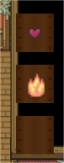

# YetAnotherRoguelike

## Основные концепции
YetAnotherRoguelike - игра в жанре Roguelike, т.е. в игре идет упор на реиграбельность - каждый забег происходит в новом сгенерированном подземелье. В таких играх очень важно дать игроку простор для действий: в этой это будет сделано через боевую систему.

## Вдохновение
Много геймплейных аспектов игры были подчеркнуты в Enter The Gungeon и Hollow Knight. Из Sekiro и Nine Sols будет реализована система парирования. 
Атмосфера в стиле Bloodborne, Crowsworn, Hellsing: готика, оккультизм и магия 18 века. 
Система заклинаний будет модифицирована из-за Noita.

## Реализованные механики
- Передвижение (WASD и dash по направлению движения).
- Боевка. Игрок использует заклинания для убийства врагов, применения эффектов на себе/врагах и т.д.
- Системы здоровья и маны.
- Генерация рандомных уровней.
- Система волн.
- Пропасти.

## Технические моменты
### Генерация уровня
Процесс происходит в несколько этапов:
- Составление графа, подходящего под существующие префабы комнат. Важная деталь: для простоты граф генерируется сразу в квадратной безразмерной сетке.
- Выбор рандомных префабов для каждой вершины графа, основываясь на положении выходов из нее.
- Подстановка и спавн комнат. Обычный BFS, который подставляет комнаты в подходящие позиции. 
Самая интересный момент - соединении комнат корридорами, чтобы следующая комната не выходила за пределы своего зарезервированного пространства. Для этого проверяется в какую сторону от этого пространства комната будет выходить при размещении ее на уровне с дверью любой предыдущей комнаты и корректируется для этого. Затем происходит спавн корридоров в одном направлении, пока комната не зайдет в ее квадрат.
- Постобработка. Происходит открытие всех дверей, перемещение игрока в стартовую комнату.

 
К скриншоту: зеленым отмечены зарезервированные квадраты для комнат, синим - комнаты, если бы они были напротив предыдущей двери.

### Мана
В игре существует мана, которая тратится на заклинания (в том числе хилл); она восполняется во время боя с линейным увеличением шага (т.е. по секундам +0.1, +0.2, +0.3 и до максимума) и прерывается при получении урона или окончании боя.
Альтернативные источники маны (в будущем) - предметы и убийство врагов.

### Контоль боев
Здесь происходит несложный контроль боев:
- Бой начинается, когда игрок касается триггера возле двери (если он еще в комнате не сражался). В это время закрываются двери.
- Бой состоит из волн, и когда одна заканчивается сразу начинается другая, а когда все волны закончатся открываются двери.

### Враги
Пока враги вселую преследуют игрока по всей комнате, только если на пути нет пропасти.

### Пропасть (Abyss)
Область, при касании которой игрок получает урон и возраждается в последнем безопасном месте.

### Заклинания
Пока в игре есть 2 заклинания - хилл и фаерболл. Они хранятся в ограниченном инвентаре игрока, что дает стимул для выбора и уступков в будущем.

### Самая заметная деталь из ETG
Контроль камеры - передвижение ближе к мышке.
